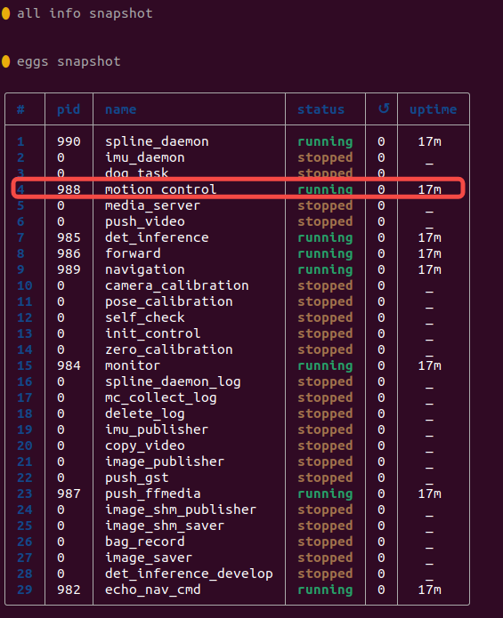

# 1. 网络通讯：
设备上配备无线网络与有线网络接口，其中无线网络信息位于设备右侧标签，标签内标注有设备SSID与密码信息。

| 网络接口 | IP地址 | DHCP |
| --- | --- | --- |
| 无线网络 | 192.168.234.1 | 有 |
| 有线网络 | 192.168.168.168 | 无 |

无线网络配备DHCP服务，连接上无线网络后，确保操作设备无线网络未配置固定IP，可以直接通过192.168.234.1与狗建立通讯。
有线网络不配备DHCP服务，通过有线连接后，需要再操作设备有线网络配置固定IP，且IP为168网段，即可与狗建立通讯。
# 2. 配置SDK
## 2.1 登录设备
设备提供ssh登录，通过WiFi或无线与设备创建连接后，可通过命令：
```bash
ssh firefly@{IP}    #密码：firefly
```
根据有线/无线修改对应的`{IP}`，密码与用户名同样为firefly。
## 2.2 查看设备版本
登录设备后，执行以下命令查看当前设备版本：
```bash
grep -oP 'motion-control_\K[^_]+' /etc/{jszr_,}release/*[^rootfs]*.yaml
```
将命令执行后的输出内容复制发送给对应技术支持人员(FAE)，FAE会提供对应版本的SDK程序。
## 2.3 修改SDK配置文件
通过vim命令修改`/opt/export/config/sdk_config.yaml`文件：
```yaml
target_ip: "127.0.0.1"
target_port: 43988
```
将`target_ip`修改为控制端设备连接狗之后的IP地址，`target_port`如无必要可不修改。
默认设备仅支持WiFi网络，即`target_ip`为`192.168.234.X`的IP地址，如需要通过网线或其他网段IP通讯，需配合步骤2.4配置`SDK_CLIENT_IP`
## 2.4 配置SDK_CLIENT_IP
如需要使用网线或其他非192.168.234.X网段IP控制设备，需要通过vim命令修改`/opt/app_launch/start_motion_control.sh`文件：

```bash

#!/bin/bash

echo "start motion control"

# 共享内存文件路径
SHM_FILE="/dev/shm/spline_shm"

# 循环检查设备是否存在
while true; do
    if [ -e "$SHM_FILE" ]; then
        echo "共享内存文件 $SHM_FILE 已存在。"
        break
    else
        echo "共享内存文件 $SHM_FILE 不存在，等待 1 秒后重试..."
        sleep 1
    fi
done

# 共享内存文件存在后执行的命令
echo "共享内存文件已准备好，可以执行后续操作。"

sudo ifconfig lo multicast
sudo route add -net 224.0.0.0 netmask 240.0.0.0 dev lo

export LD_LIBRARY_PATH=/opt/export/mc/bin
export ROBOT_TYPE=P2
# export SDK_CLIENT_IP="机器人新ip"

cd /opt/export/mc/bin && taskset -c 7 ./mc_ctrl r
``` 
在上面代码27行，增加对应配置:`export SDK_CLIENT_IP="机器人新ip"`，并将机器人的IP地址填写在对应参数内，如使用有线网络，则将机器人新IP修改为192.168.168.168,如果是其他IP则修改到对应IP即可。
# 3. 异常处理
## 3.1 开机后运控启动时网络端口未初始化
部分情况下会存在运控程序启动时，系统网络未初始化完成，此时使用SDK调用运动控制时会存在无法正常使用。
若存在上述现象，可通过登录主控内执行`robot-launch list`查看程序列表，并选择对应`motion control`的程序前方对应的编号，如下图所示执行`robot-launch restart 4`进行重启运控程序，再使用SDK时是否恢复正常。

若恢复正常，可在运控启动脚本中增加休眠，等待网络初始化完成后再启动运控即可，具体操作方法如下：
按当前文档操作步骤2.4所示，编辑文件`/opt/app_launch/start_motion_control.sh`并在最后一行脚本上方增加`sleep 10`即可。
此现象仅在设备断电重启后会存在

## 3.2 python程序运行时报ModuleNotFoundError: No module named 'py_whl.mc_sdk_py.mc_sdk_py'
默认py_whl的目录下面存放的是x86_64的so包，若设备为arm64架构，请将py_whl目录下的so包替换为lib目录下arm64的so包即可。

## 3.3 py_whl打包whl文件
确保步骤3.2中的so包已替换为对应系统的so包后，在py_whl目录下执行以下命令打包whl文件：
```python
python3 setup.py bdist_wheel  --python-tag py310 --plat-name $(uname -s)_$(uname -i)
```
打包后在dist目录下生成mc_sdk.whl文件，通过pip安装mc_sdk.whl文件即可。
# 4. FAQ
1. 运控中获取设备状态接口支持频率：
- lowlevel 的500hz, highlevel的50hz。
2. 运控中请求接口支持频率：
- 请求数据需要以500hz发送才能保证设备稳定运行。
  
